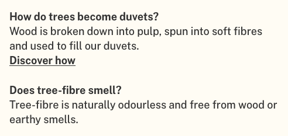
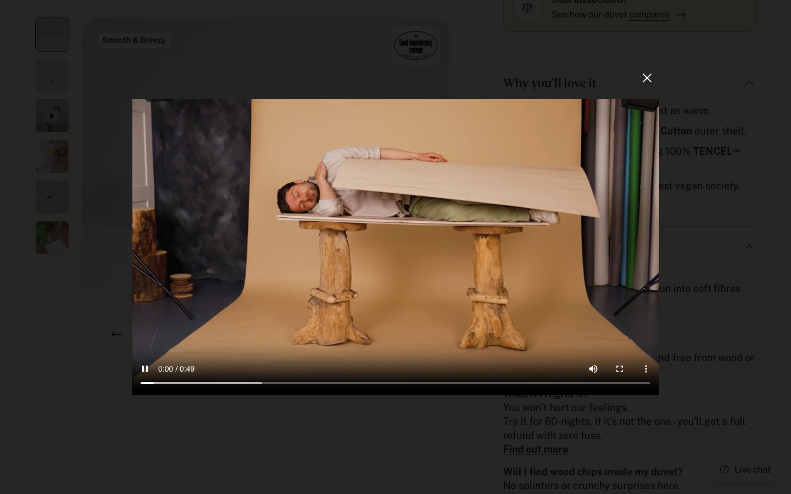
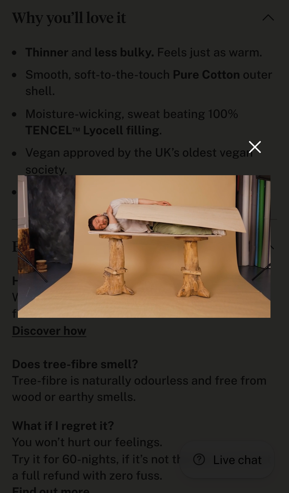
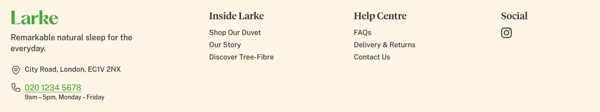
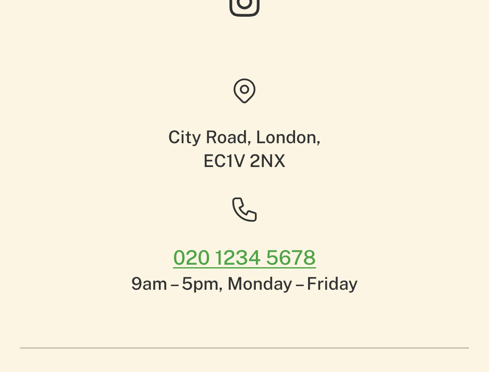
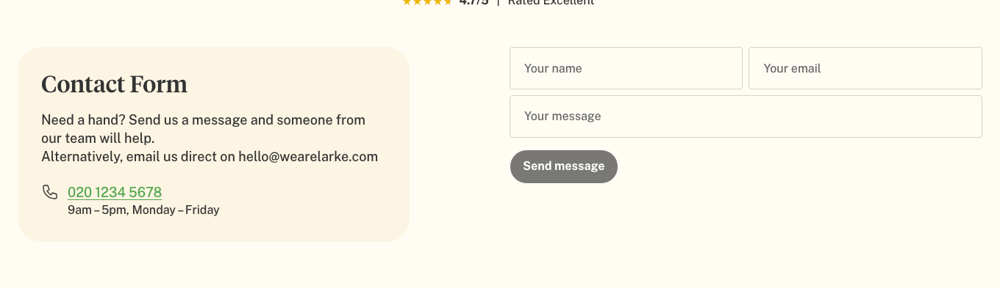
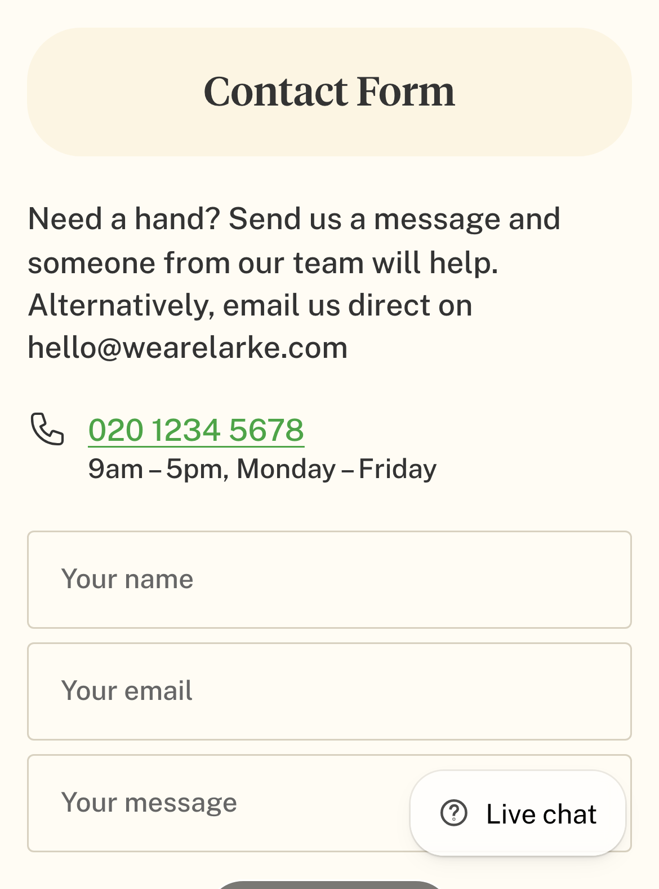

# Proof — FAQ video + landline number (2026-09-25)

Verified on the **store preview** (theme `201771843931`), not a local mock:
<https://wearelarke.myshopify.com/?preview_theme_id=201771843931>

Screenshots and checks were captured with a headless browser against that preview at **desktop
1440 × 900** and **iPhone 13 (390 × 844)**. Every number in the tables below was read off the live
page, not assumed.

---

## Task 1 — FAQ "How do trees become duvets?" → opens the homepage video on the same page

**Where it lives:** product page (`/products/natural-duvet`) → **FAQs** accordion →
*"How do trees become duvets? … **Discover how**"*. (There is no such question on `/pages/faq`; the
product page's FAQ block is the one with this link.)

**Before:** "Discover how" linked to `/pages/tree-fibre` — the shopper left the product page.
**After:** "Discover how" links to `#video` and opens the **homepage's video** ("Trees into duvets –
who would've thought?", file *Larke V4 Video LogoOnly (1).mp4*) in the homepage's own pop-up player,
without leaving the page.

| Check | Desktop | Mobile |
|---|---|---|
| Pop-up opens on click | ✅ | ✅ |
| Page URL unchanged (stays on the product page) | ✅ | ✅ |
| Video starts playing | ✅ | ✅ |
| Same video file as the homepage banner | ✅ `32400a12…m3u8` = homepage `32400a12…m3u8` | ✅ |
| Escape closes it (also the × and a click on the dark area) | ✅ | ✅ |

The FAQ link:

After clicking **Discover how** — desktop:

After clicking **Discover how** — mobile:

**How it's built (reusable, no code needed next time):** a new **Video lightbox** section
(`sections/dev-video-lightbox.liquid` + `.css` + `.js`) added to the product template. It shows
nothing on the page; any link pointing to `#video` opens it. To give another page (e.g. the FAQ
page) the same "watch the film" link: theme editor → add section **Video lightbox** → pick the
video → link to `#video`. The player is the homepage banner's, reproduced exactly (same size, same
fade in/out timing, same close button, same adaptive streaming, focus kept inside while open).

---

## Task 2 — Larke landline in the footer and on the contact form

Number and hours are set **once**, in **Theme settings → Contact details**, and feed both places —
so the footer and the contact form can never show different numbers. The tap-to-call link is built
from the number automatically (`020 1234 5678` → `tel:+442012345678`, international format so it
also dials correctly from a phone abroad).

### 2a. Footer — phone under the address, clickable, opening hours on a new line

| Check | Desktop | Mobile |
|---|---|---|
| Number shown under the address | ✅ | ✅ |
| Clickable `tel:` link | ✅ `tel:+442012345678` | ✅ |
| Opening hours on a new line | ✅ 9am – 5pm, Monday – Friday | ✅ |
| Tap area (min. 44 px recommended on touch) | — | ✅ 44 px |

Desktop:

Mobile (the site's mobile footer is centred, so the phone follows the address's centred layout):

### 2b. Contact form — phone under the email, clickable, hours, 24–32 px space

| Check | Desktop | Mobile |
|---|---|---|
| Number shown under the email line | ✅ | ✅ |
| Clickable `tel:` link | ✅ `tel:+442012345678` | ✅ |
| Opening hours on a new line | ✅ | ✅ |
| Space between email line and phone (asked: 24–32 px) | ✅ **24 px** (measured) | ✅ **24 px** (measured) |
| Phone icon level with the number | ✅ | ✅ |
| Tap area | — | ✅ 45 px |

Desktop:

Mobile:

---

## ⚠️ Needs a decision before this goes live

1. **The number is the mockup's `020 1234 5678`.** It looks like a placeholder, and no real
   landline was found in ClickUp or on the live site. Replace it in **Theme settings → Contact
   details → Phone number**; both places update, and the call link follows automatically.
2. **Green link contrast.** The number uses the brand green from the mockup (`#4EA448`, the logo's
   green). As text on the cream background that is ~2.8 : 1, below the 4.5 : 1 accessibility
   guideline. It can be switched to a darker green (Contact form section → Colors → Phone number;
   the footer uses its Accent colour) or to the normal text colour.

## Notes

- One console error appears on every page of the preview:
  `eyJhbGciOi… is not defined`. It comes from a third-party script, not from these changes (it was
  already present on the blog pages checked on 2026-09-22).
- Files changed: `sections/dev-site-footer.liquid`, `assets/dev-site-footer.css`,
  `sections/dev-contact-form.liquid`, `assets/dev-contact-form.css`, `config/settings_schema.json`,
  `templates/product.json`; new: `sections/dev-video-lightbox.liquid`, `assets/dev-video-lightbox.css`,
  `assets/dev-video-lightbox.js`, `snippets/dev-phone-href.liquid`.
- `shopify theme check`: no offences in any changed file.
