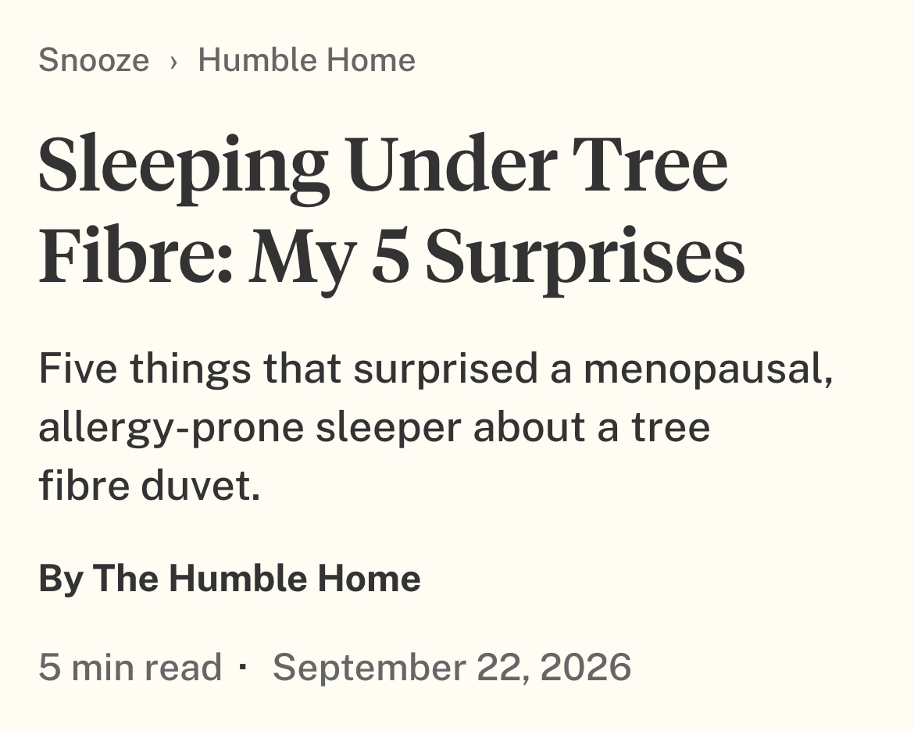
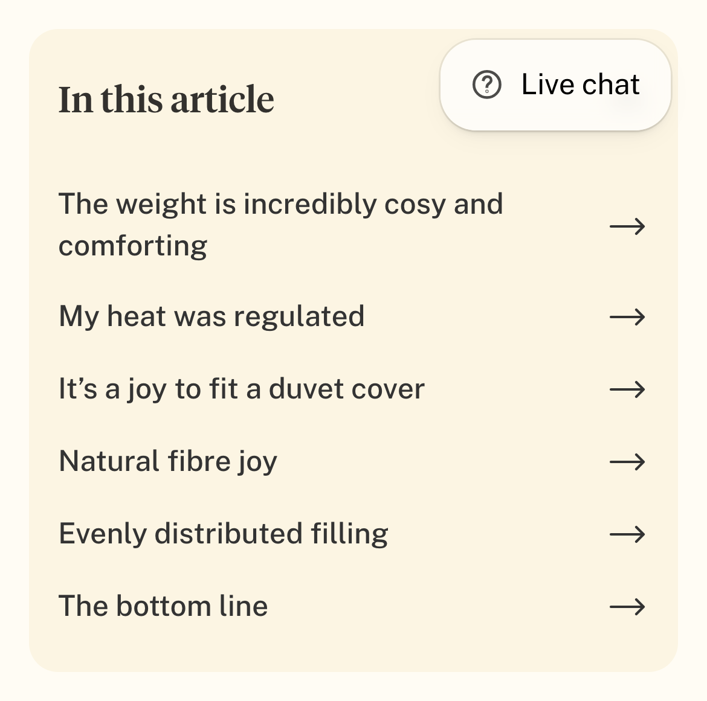
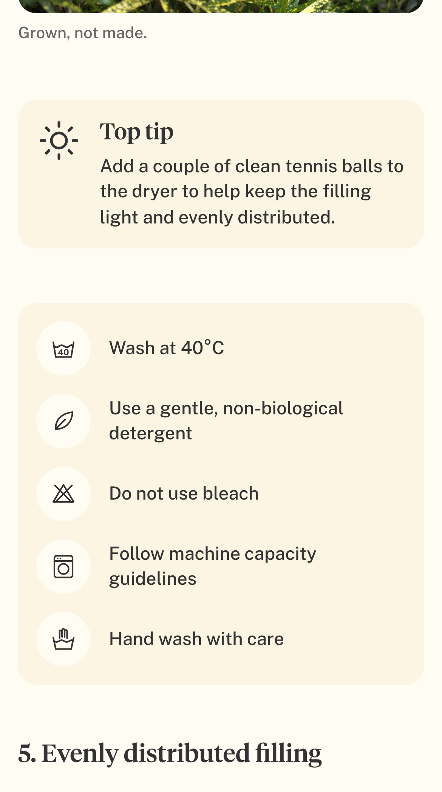
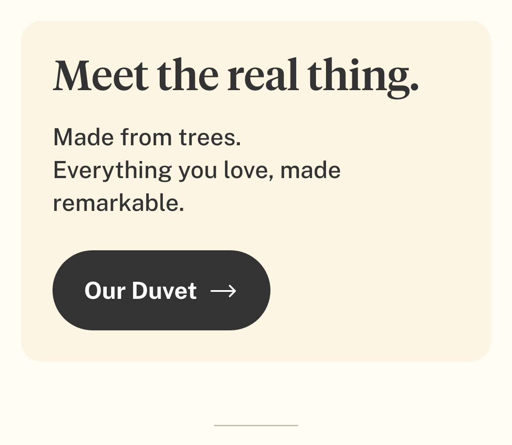
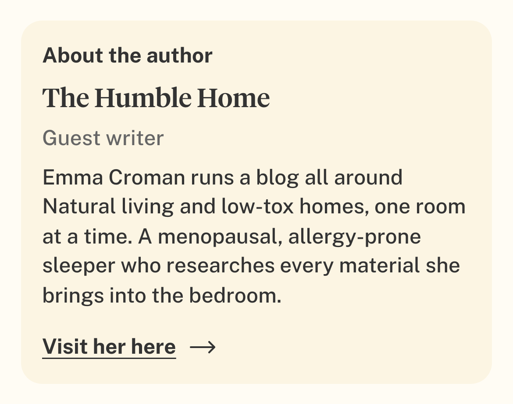
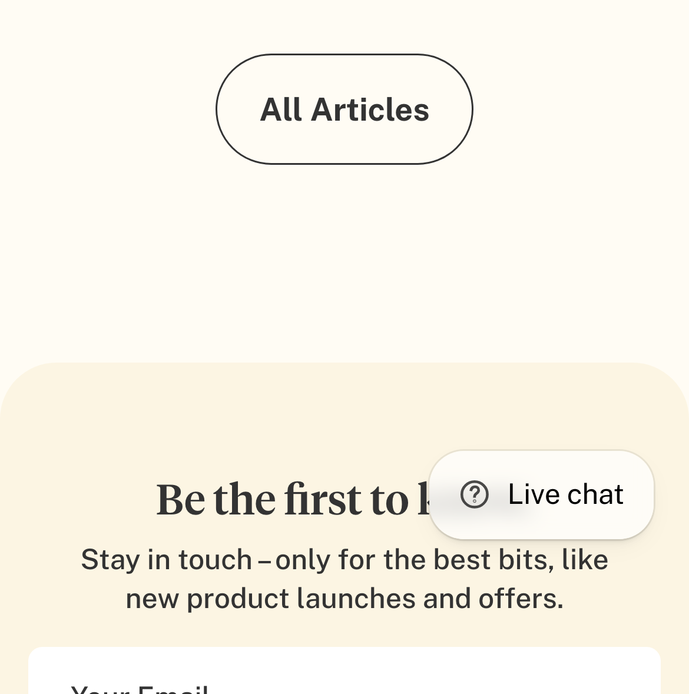

# Proof — blog post review fixes (2026-09-28)

Verified on the **store preview** (theme `201771843931`), iPhone 13 size, post
<https://wearelarke.myshopify.com/blogs/news/sleeping-under-tree-fibre-my-5-surprises?preview_theme_id=201771843931>.
Checks below were read off the live page, not assumed. (Screenshots hide the Shopify preview bar and
sticky header so the content is visible; the "Live chat" bubble is the site's own chat widget.)

| # | Request | Result |
|---|---|---|
| 1 | Top tip after Section 4, directly before the wash-care box. Order: Section 3 → Section 4 → Top tip → Wash care | ✅ |
| 2 | Breadcrumb "News › Guest Review" → "Snooze › Humble Home" | ✅ links: `/blogs/news`, `/blogs/news/tagged/humble-home`; structured data matches |
| 3 | Darker separator dot between "5 min read" and the date | ✅ dot `#333` (text colour); words stay grey `#666` |
| 4 | "Meet the real thing." product banner (Option 1) | ✅ button **Our Duvet →** links to `/products/natural-duvet` (the real product, not the "(Copy)") |
| 5 | Delete "A calmer planet sleeps brighter." | ✅ removed; "All Articles" now flows into the footer's "Be the first to know." |
| 6 | "In this article": no numbers, right arrow on every row | ✅ |
| 7 | Dropdown auto-close behaviour | ✅ see table below |
| 8 | "View all articles" → "All Articles" | ✅ |
| 9 | Author card: new bio, "Visit her here →" to https://thehumblehome.uk/, underlined, dark | ✅ underlined, `#333`, opens in a new tab; name no longer a link |

**Dropdown behaviour (measured):**

| Step | Expected | Result |
|---|---|---|
| Page load | closed | ✅ closed |
| Tap | opens | ✅ open |
| Small scroll down / up | stays open | ✅ open |
| Scroll until the whole box is off-screen (down) | closes | ✅ closed — reading position moved **0 px** |
| Scroll back up | stays closed | ✅ closed |
| Open, then scroll away upward | closes | ✅ closed |

## Screenshots

Header — breadcrumb and darker dot:

"In this article" — no numbers, arrows:

Top tip moved after Section 4, before the wash-care box:

"Meet the real thing." banner:

Author card:

"All Articles" into the footer newsletter (closing panel gone):

## Placement assumption

The "Meet the real thing." banner sits straight after the article body, before "About the author" —
the brief did not say where. It is a normal section: drag it anywhere in the theme editor.
