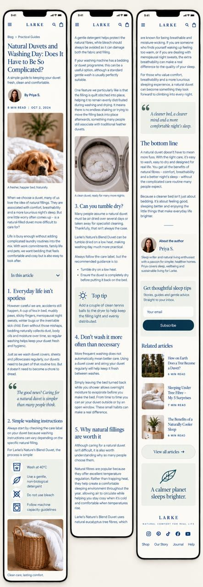
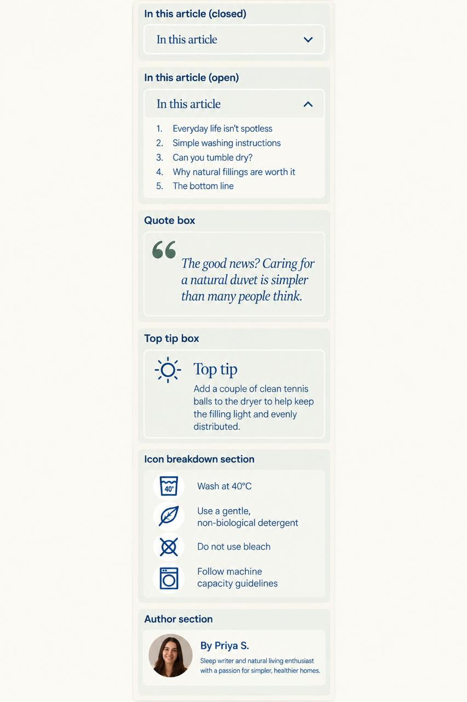

# Blog structure reference

The two mockups the blog templates are built from, supplied by the client on 2026-09-16.
They are **mobile only** and they are concept renders, not Figma artboards — there is still no
artboard for the blog. Treat them as **structure and component inventory**, never as measurements:
every size, spacing, colour and font comes from the already-measured `dev-*` sections instead.
See `docs/superpowers/plans/2026-09-22-blog-templates.md`.

## Article flow

Top to bottom: breadcrumb → title → deck → author row → meta (read time · date) → hero + caption →
prose → "In this article" accordion → numbered `<h2>` sections → quote box → icon breakdown →
top tip box → inline figures → "The bottom line" → author card → newsletter → related articles →
"View all articles" → closing brand panel → footer.

## Component inventory

"In this article" (closed / open) · quote box · top tip box · icon breakdown · author card.

## Test content

The client also supplied a real guest post — *The Humble Home x Larke Sleep, "Sleeping Under Tree
Fibre — My 5 Surprises"* (`THHxLaarke.docx`) — five numbered sections of long-form prose. Load it as
a draft article and build against it; a template that only looks right with lorem ipsum is not done.
